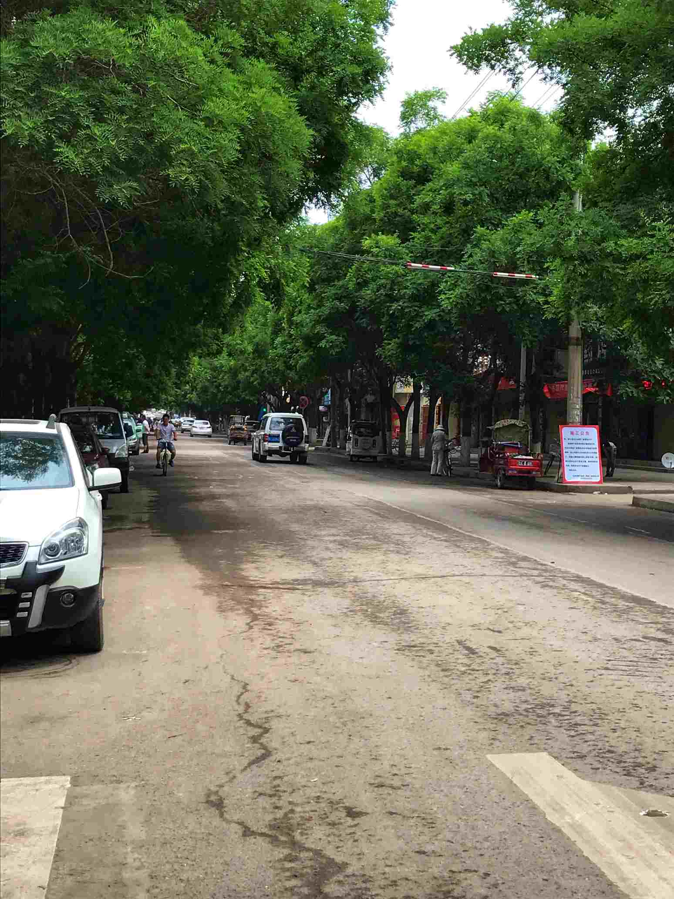

时时刻刻准备着！(ง •_•)ง

# 🔑面试题 🔑
## 🍉HTML+CSS
[1、掌握盒子水平垂直居中的五大方案](./面试/html+css/node/掌握盒子水平垂直居中的五大方案.md)

[2、关于css3中盒子模型的几道面试题](./面试/html+css/node/关于css3中盒子模型的几道面试题.md)

[3、掌握几大经典布局方案](./面试/html+css/node/掌握几大经典布局方案.md)
## 🍉JS
[1、JS基础速记](./面试/js/node/JS基础速记.md)

[2、关于堆栈内存的几道面试题](./面试/js/node/关于堆栈内存的几道面试题.md)

[3、关于闭包的几道面试题](./面试/js/node/关于闭包的几道面试题.md)

[4、关于对象(数组)的深浅克隆](./面试/js/node/关于对象(数组)的深浅克隆.md)

[5、一道面向对象的面试题(阿里)](./面试/js/node/一道面向对象的面试题(阿里).md)

[6、一道关于JS微任务和宏任务的面试题(头条)](./面试/js/node/一道关于JS微任务和宏任务的面试题(头条).md)

[7、关于==的一道面试题](./面试/js/node/关于==的一道面试题.md)

[8、vue的双向数据绑定](./面试/js/node/vue的双向数据绑定.md)

[9、JS原型链](./面试/js/node/JS原型链.md)

[10、关于JS中的继承](./面试/js/node/关于JS中的继承.md)

[11、关于JS防抖](./面试/js/node/关于JS防抖.md)

# 📖开发笔记📖
## 🖋 JS
[随笔](./笔记/随笔.md)

[angularJs札记](./笔记/angularJs札记.md)

[JavaScript数组中的slice方法和aplice方法的区别](./笔记/JavaScript数组中的slice方法和aplice方法的区别.md)

[javascript之break](./笔记/javascript之break.md)

[js自定义事件](./笔记/js自定义事件.md)
## 🖋 turf.js
本身自己毕业以来，从事的前端开发工作更侧重于GIS领域，因此会遇到很多的GIS相关的问题。turf.js这个库给了我大部分的解决方案，但是比较遗憾的是这个库的API是全英文的，所以，今天开始，在这里我将会记录自己平时使用turf.js解决了自己工作中的那些WebGIS的问题。

[turf-->计算两个polygon的交点](./笔记/turf之计算两个polygon的交点.md)

[turf-->计算polygon或linestring的自交点](./笔记/turf之计算polygon或linestring的自交点.md)

# 尾

这里通常会放一张自己喜欢的照片

## 静宁县西环路
 
